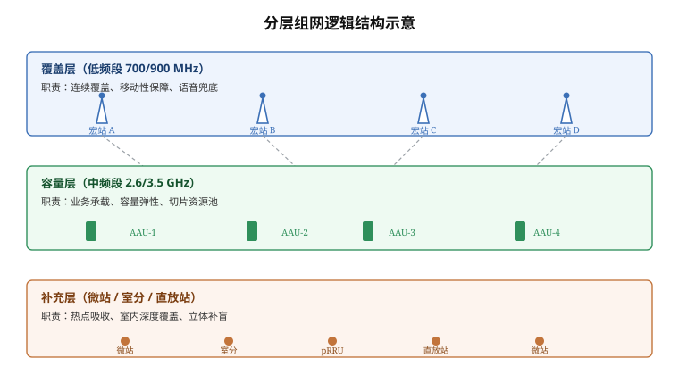
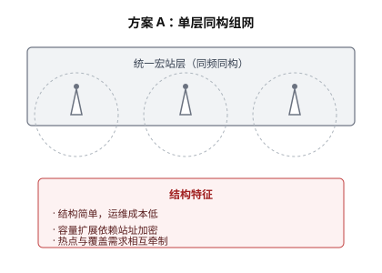
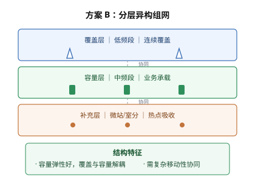

# 面向 5G-A 演进的城市密集区网络规划要点

::: abstract 内容提要
- 城市密集区进入容量驱动阶段的三项量化判据（PRB 利用率、感知速率、连接数）
- 站址加密存在边际递减：ISD 低于 250 m 后干扰受限，需转向参数与结构调整
- 分层组网是覆盖与容量解耦的较优形态，通感一体区域需单独建模站址
- 实施次序：先参数挖潜、再结构调整、后站址新增
:::

## 一、规划背景与目标

城市密集区是移动网络容量压力最集中的区域。以某省会城市核心商圈为例，工作日 18:00–21:00 时段的下行 PRB 平均利用率长期维持在 **78% 以上**，部分宏站小区峰值超过 92%，已接近容量告警线。本节讨论的规划目标有三条：一是把忙时 PRB 利用率压降到 70% 以下，二是保证 5G-A 通感一体与 RedCap 业务的承载需求，三是控制新增站址数量，优先通过存量资源的参数挖潜与结构调整解决问题。

从网络演进的节奏看，5G-A 相较 5G 的增量能力主要集中在三个方面：上行增强（补充上行 SUL、灵活双工）、确定性体验（低时延保障、网络切片）、以及通感一体（ISAC）。这三类能力对站址密度的诉求并不一致，因此在规划阶段就必须区分对待，不能简单地用统一加站策略覆盖。[^1]

[^1]: 三类能力的划分方式在业界尚未完全统一，本节采用较常见的三分法，即以"资源维度"作为划分依据：上行增强对应时频资源，确定性体验对应调度与承载资源，通感一体对应空域与站址资源。

### 1、容量压力的量化判据

判断一个区域是否进入"容量驱动"阶段，行业上通常采用以下组合判据。当三项判据中有两项同时成立时，即应启动容量扩容评估。

表：容量驱动的量化判据与触发阈值

| 判据维度 | 触发阈值 | 数据来源 | 建议动作 |
|---|---|---|---|
| 忙时 PRB 平均利用率 | > 70% | 网管性能数据（小时级） | 启动扩容评估 |
| 忙时 PRB 峰值利用率 | > 90% | 网管性能数据（15 分钟级） | 优先扩容，纳入本期 |
| 单小区忙时流量 | > 800 MB/h | 网管 KPI 汇总 | 结合用户数判断 |
| 用户感知速率（下行） | < 8 Mbps | 用户面采样或路测 | 感知劣化确认 |
| 小区平均 RRC 连接数 | > 300 | 网管性能数据 | 判断连接数驱动 |

上述阈值并非国标强制值，而是行业实践中较常见的经验界线，具体项目中应结合本地网络基线做标定。需要特别注意的是，**判据之间可能存在矛盾**：某小区 PRB 利用率高但用户速率尚可，说明是资源调度效率问题而非容量绝对不足，此时扩容并非最优解。

#### 1.1 三项判据的组合使用

三项判据中只要有两项同时成立，即应启动容量扩容评估；若仅有一项成立，则应先排查参数配置与邻区干扰，再判断是否需要新增资源。以峰值利用率 95%、平均利用率 72% 的小区为例，两项同时成立，属于典型的容量受限场景；反之，若峰值高而均值低，则更可能是调度策略或突发业务导致。

##### 1.1.1 判定顺序

判定顺序建议为：先看峰值类指标（对应瞬时拥塞与掉话风险最高），再看均值类指标（对应长期资源紧张），最后核对连接数（用于区分容量不足与调度效率不足）。三步的结论不一致时，以峰值类指标的结论为准。

### 2、与 5G-A 新增能力的关系

5G-A 的三类增量能力对网络资源的需求方向不同，规划时应分别评估：

- **上行增强**：主要消耗上行时隙与频谱资源，对站址密度不敏感，对设备能力敏感；
- **确定性体验**：主要消耗调度优先级与传输承载资源，对核心网与承载网敏感；
- **通感一体**：需要专用时频资源与站址协同，**对站址密度与拓扑结构最敏感**。

因此，在通感一体试点区域，站址规划需要单独建模；而在仅做上行增强的区域，可优先考虑存量站点的软件升级。

## 二、站址密度与仿真结论

本节给出三个典型场景的站址密度仿真结论。仿真基于 3.5 GHz 频段、64T64R 大规模天线、站间距 200–400 m 的城区宏站模型，用户分布采用不均匀热力图投放。

### 1、站间距与容量关系

仿真采用的主要参数与取值如下。

表：站址密度仿真的主要参数与取值

| 参数 | 取值 | 说明 |
|---|---|---|
| 频段 | 3.5 GHz（n78） | 主流中频段 |
| 系统带宽 | 100 MHz | 单载波 |
| 天线配置 | 64T64R | 大规模天线 |
| 站间距（ISD） | 200 / 250 / 300 / 400 m | 四档对比 |
| 用户分布 | 热力图（热点占比 30%） | 不均匀投放 |
| 业务模型 | 混合业务（eMBB 为主） | 含 10% 上行受限业务 |
| 仿真时长 | 10 万 TTI | 统计稳定 |

仿真结果显示，站间距从 400 m 收紧至 250 m 时，小区边缘下行速率提升约 **2.3 倍**，但继续收紧至 200 m 时，增益快速下降至 1.2 倍左右——这是干扰受限效应开始主导的信号。换言之，**加密并非收益线性递增**。

> 依据：上述仿真结论来自公开的 5G 网络规划方法学研究与行业仿真经验值，具体数值随地形、站高、下倾角配置而变化，工程应用中应结合本地数据复算。

### 2、干扰受限的临界点判断

判断区域是否已进入"干扰受限"状态，可采用如下经验方法：在仿真中逐档收紧站间距，观察边缘速率曲线的斜率变化。当相邻两档的增益比低于 1.3 时，即认为已进入干扰受限区间。

进入干扰受限区间后，继续加密的效果有限，正确的做法是转向以下三个方向之一：

1. **调整下倾角与方位角**，压缩越区覆盖，改善 SINR 分布；
2. **引入容量层与覆盖层分离**，用中频段做容量、低频段做覆盖；
3. **改用分布式部署形态**（如 pRRU 拉远），在热点内部署而非周边加密。

### 3、典型场景对比

三个典型场景的规划策略差异如下表所示。

表：三类典型场景的规划策略对比

| 场景类型 | 典型 ISD | 主要矛盾 | 首选策略 | 备选策略 |
|---|---|---|---|---|
| CBD 高层商务区 | 200–250 m | 立体覆盖与容量双重压力 | 分层组网 + 室分补盲 | 微站加密 |
| 高校校园 | 250–300 m | 潮汐效应明显 | 宏微协同 + 载波灵活配置 | 移动应急车 |
| 交通枢纽 | 300–350 m | 高移动性与容量突发 | 多波束协同 + 专网切片 | 室内分布系统 |

需要说明的是，"首选策略"并非排他性方案，实际项目中通常是多种手段组合使用，需通过仿真验证组合收益。

### 4、容量估算的理论上界

在理想条件下，单小区下行峰值吞吐量的理论估算可采用香农公式：

$$C = B \cdot \log_2\left(1 + \frac{S}{N}\right)$$

其中 $C$ 为信道容量（bit/s），$B$ 为系统带宽（Hz），$S/N$ 为信噪比。以 100 MHz 带宽、信噪比 20 dB 为例，理论上界约为 665 Mbps；实际系统因调度开销、导频占用与信道估计误差，通常只能达到理论值的 35%–45%。

> 说明：上式中的信噪比需按**线性值**代入，若已知 dB 值须先做 $10^{SNR_{dB}/10}$ 换算。

## 三、典型组网结构

下图给出分层组网的逻辑结构示意。



图：分层组网逻辑结构示意

上层为覆盖层，使用低频段提供连续覆盖与移动性保障；中层为容量层，使用中频段承载业务；底层为补充层，由微站、室分与直放站构成，处理热点与室内深度覆盖。三层之间通过统一的移动性策略管理。

### 1、并排对比示意

下面用并排图的方式对比两种组网形态的差异。

::: figure-row



:::

图：单层同构与分层异构两种组网形态对比

两种形态的核心差异在于：方案 A 结构简单、运维成本低，但容量扩展依赖加密站址；方案 B 容量弹性更好，但需要更复杂的移动性管理与参数协同。

### 2、关键参数配置

主要射频参数的推荐配置范围如下。

表：覆盖层、容量层与补充层的射频参数配置范围

| 参数 | 覆盖层 | 容量层 | 补充层 |
|---|---|---|---|
| 下倾角（机械 + 电调） | 4°–8° | 6°–10° | 按需 |
| 发射功率 | 40 W | 80 W | 10–20 W |
| 站高 | 30–45 m | 25–35 m | 6–15 m |
| 天线下倾策略 | 固定 | 可调 | 固定 |

### 3、覆盖概率的快速估算脚本

工程现场常用简化的对数距离路径损耗模型做快速估算，参考实现如下。

```python
import math

def rsrp_at(d_km: float, p_tx_dbm: float = 46.0,
            f_mhz: float = 3500.0, h_bs: float = 30.0) -> float:
    """对数距离路径损耗模型：RSRP 估算（dBm）

    参数
    ----
    d_km   : 收发距离（km）
    p_tx_dbm: 发射功率（dBm），默认 46 dBm ≈ 40 W
    f_mhz  : 载波频率（MHz）
    h_bs   : 基站天线挂高（m）

    说明：本函数为演示用简化模型，未含穿透损耗、人体损耗与
         天线增益方向图，实际工程须以仿真或路测为准。
    """
    if d_km <= 0:
        raise ValueError("距离必须大于 0")

    # 3GPP 视距近似下的截距（演示取值，非标准公式）
    intercept = 32.4 + 20 * math.log10(f_mhz)
    slope = 10 * 2.2 * math.log10(d_km)
    return p_tx_dbm - intercept - slope
```

调用 `rsrp_at(0.25)` 可得 250 m 处的估算电平。需注意该模型的截距项为示意取值，**不可直接用于正式覆盖预测**。

## 四、实施要点与风险

### 1、工程实施顺序

推荐的实施顺序为：先做参数优化，再做结构调整，最后考虑新增站址。具体步骤如下。

1. **参数挖潜阶段**（1–2 个月）：优化下倾角、方位角、发射功率与调度参数，验证容量改善幅度；
2. **结构调整阶段**（2–3 个月）：评估载波扩容、双频段协同、室分系统改造的可行性；
3. **站址新增阶段**（3–6 个月）：在前两步无法满足需求时启动，同时完成站址勘察与配套建设；
4. **效果验证阶段**（持续）：通过路测与网管指标双重复核，形成闭环。

> 风险提示：参数优化阶段的收益往往被高估。实践中，参数挖潜的容量增益通常在 15%–25% 之间，若初始 PRB 利用率已超过 90%，仅靠参数优化难以达标。

### 2、主要风险与应对

表：工程实施的主要风险与应对措施

| 风险项 | 影响程度 | 发生概率 | 应对措施 |
|---|---|---|---|
| 站址获取困难 | 高 | 中 | 提前启动选址，准备备选点位 |
| 干扰恶化 | 中 | 高 | 仿真预验证，保留调整余量 |
| 配套电源不足 | 中 | 低 | 勘察阶段确认配套条件 |
| 投资超预算 | 高 | 中 | 分期实施，设置投资闸门 |
| 覆盖与容量冲突 | 中 | 中 | 分层组网，独立优化 |

### 3、验收指标

项目验收时应同时满足覆盖与容量两类指标，缺一不可。

表：验收指标与验证方式

| 指标类别 | 具体指标 | 目标值 | 验证方式 |
|---|---|---|---|
| 覆盖 | 弱覆盖比例 | < 3% | 路测 + MDT |
| 覆盖 | 上行边缘速率 | > 1 Mbps | 路测采样 |
| 容量 | 忙时 PRB 利用率 | < 70% | 网管统计 |
| 容量 | 下行平均速率 | > 20 Mbps | 网管 + 路测 |
| 体验 | 视频初始缓冲时长 | < 1.5 s | 业务质量平台 |

## 五、结论

综合仿真与工程经验，城市密集区的 5G-A 演进规划应遵循"先挖潜、再调整、后加密"的次序，并在通感一体等新增能力区域单独建模站址需求。核心结论有四点：

1. 站址加密的收益存在明显边际递减，ISD 低于 250 m 后需警惕干扰受限；
2. 参数优化的容量增益有限（15%–25%），不能替代结构性扩容；
3. 分层组网是兼顾覆盖与容量的较优形态，但需配套移动性策略；
4. 验收应覆盖与容量双指标并重，避免单一维度的"达标"。

> 说明：本文为工具演示用途编写的示例文档，文中数值为示意性取值，不构成工程建议。实际项目请以本地网络数据与仿真结论为准。
